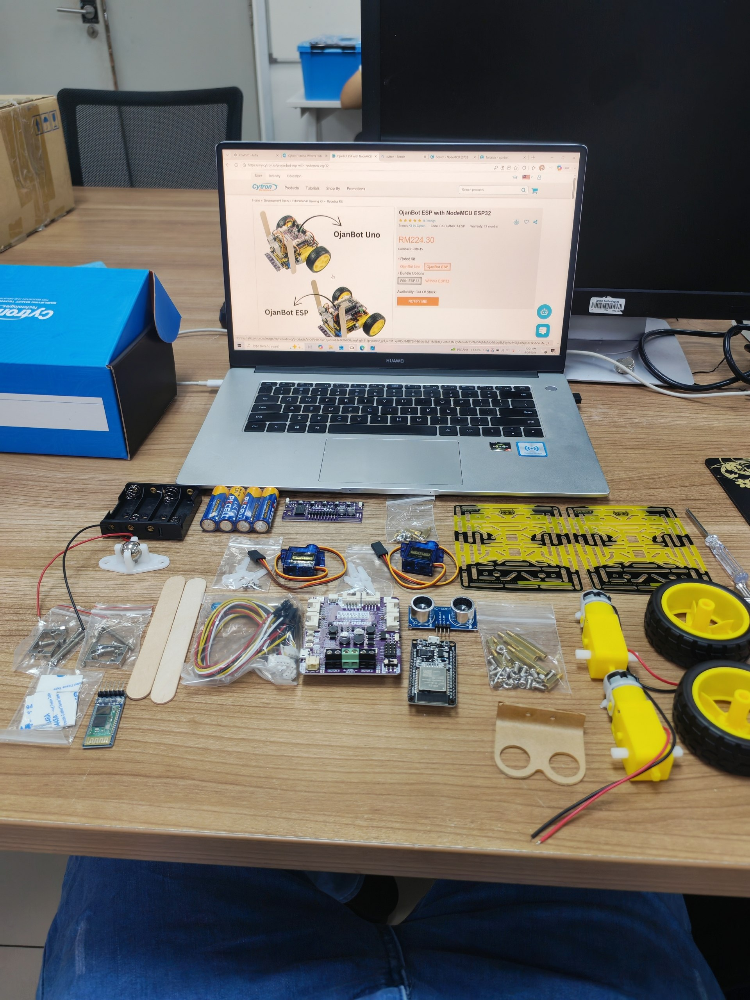
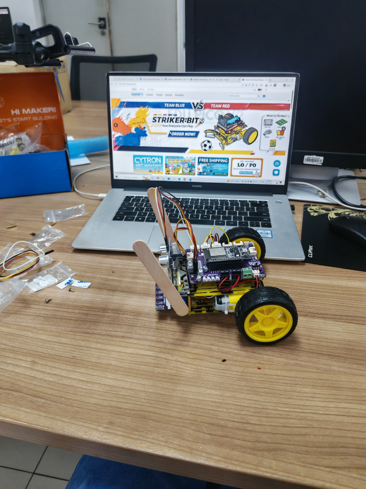
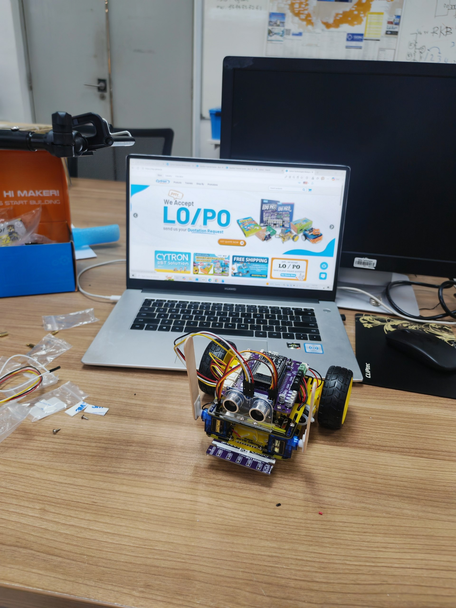
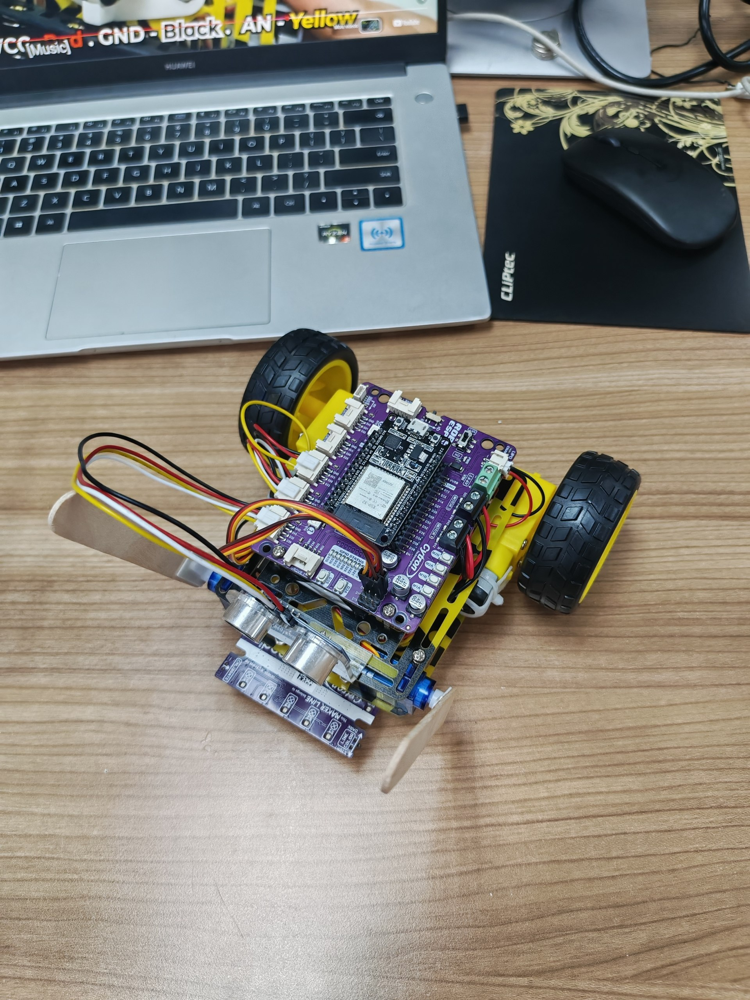
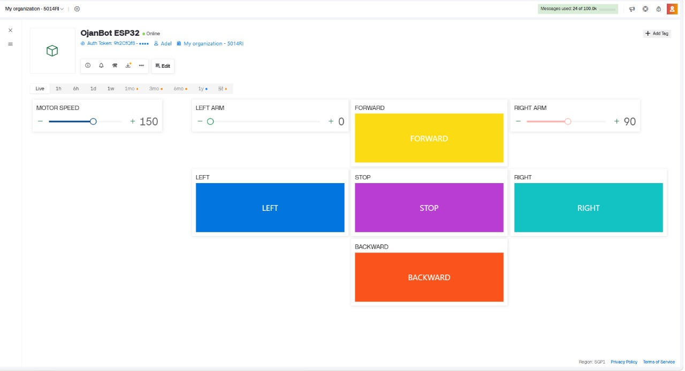

# OjanBot ESP32 Blynk Wi-Fi Control


Wireless control system for the Cytron OjanBot ESP32 using the Blynk IoT platform and Wi-Fi communication.

---

## Project Overview

This project demonstrates a wireless control system for the Cytron OjanBot ESP32 robot.

The robot is controlled remotely using a Blynk IoT dashboard. The ESP32 connects to the Blynk platform through Wi-Fi and receives commands from the dashboard.

The Blynk dashboard provides control of the robot's movement, motor speed, and servo arms.

---

## Features

- Wi-Fi wireless robot control
- Blynk IoT dashboard
- Forward movement
- Backward movement
- Left turn
- Right turn
- Stop control
- Adjustable motor speed
- Right servo arm control
- Left servo arm control
- ESP32-based robot control
- Real-time communication through Blynk

---


# Hardware Components

The main hardware components used in this project include:

- Cytron OjanBot ESP32
- Robo ESP32 board
- NodeMCU ESP32
- Two DC motors
- Two wheels
- Two servo motors
- Ultrasonic sensor
- LiPo battery
- Connection cables
- Robot chassis and mechanical parts



**Figure 1.** Hardware components used in the OjanBot ESP32 project.

---

# Robot Assembly

## 1. Completed OjanBot ESP32

The OjanBot ESP32 was assembled with the Robo ESP32 board, NodeMCU ESP32, DC motors, servo motors, and ultrasonic sensor.



**Figure 2.** Completed OjanBot ESP32 robot.

---

## 2. Front View

The front view shows the ultrasonic sensor and the two servo arms mounted on the robot.



**Figure 3.** Front view of the completed OjanBot ESP32.

---

## 3. Top View

The top view shows the ESP32, Robo ESP32 board, motor connections, servo connections, and wiring.



**Figure 4.** Top view of the OjanBot ESP32 and its connections.

---

# Hardware Connections

The robot uses the Robo ESP32 board to control the motors and servo motors.

## Motor Connections

| Motor | Pin | Function |
|---|---|---|
| M1A | D12 | Left Motor |
| M1B | D13 | Left Motor |
| M2A | D14 | Right Motor |
| M2B | D27 | Right Motor |

The motor direction was configured according to the physical motor installation.

## Servo Connections

| Servo | ESP32 Pin |
|---|---|
| Right Servo | D4 |
| Left Servo | D5 |

## Ultrasonic Sensor

The ultrasonic sensor is connected through Grove Port 6.

| Ultrasonic Signal | ESP32 Pin |
|---|---|
| TRIG | D32 |
| ECHO | D39 |

---

# Blynk Dashboard

The robot is controlled using a Blynk IoT dashboard.

The dashboard provides controls for:

- Motor Speed
- Forward
- Backward
- Left
- Right
- Stop
- Right Arm
- Left Arm



**Figure 5.** Blynk dashboard used to control the OjanBot ESP32.

---

# Blynk Datastreams

The following virtual datastreams are used in the project:

| Virtual Pin | Name | Range | Function |
|---|---|---|---|
| V0 | Motor Control | 0–4 | Robot movement |
| V1 | Right Arm | 0–180 | Right servo angle |
| V2 | Left Arm | 0–180 | Left servo angle |
| V3 | Stop | 0–1 | Stop command |
| V4 | Motor Speed | 0–255 | Motor speed |

## Motor Control Values

| Value | Command |
|---|---|
| `0` | Stop |
| `1` | Forward |
| `2` | Backward |
| `3` | Left |
| `4` | Right |

---

# System Operation

The complete system operates as follows:

```text
Blynk Dashboard
       │
       │ Wi-Fi / Internet
       ▼
Blynk Cloud
       │
       ▼
ESP32
       │
       ▼
Robo ESP32
       │
       ├──────────────► DC Motors
       │
       └──────────────► Servo Motors
```

The user selects a command from the Blynk dashboard.

The command is sent through the Blynk platform to the ESP32.

The ESP32 processes the received command and controls the motors or servo motors accordingly.

---

# Robot Movement

The robot supports four movement commands and a stop command.

### Forward

Both motors rotate in the direction required to move the robot forward.

### Backward

Both motors rotate in the opposite direction to move the robot backward.

### Left

The motors rotate in opposite directions to turn the robot left.

### Right

The motors rotate in opposite directions to turn the robot right.

### Stop

Both motors are stopped.

---

# Servo Control

The Blynk dashboard provides two sliders for controlling the robot arms.

### Right Arm

The right servo can be controlled from:

```text
0° to 180°
```

### Left Arm

The left servo can also be controlled from:

```text
0° to 180°
```

Both servos are initialized at:

```text
90°
```

---

# Motor Speed Control

The motor speed can be adjusted directly from the Blynk dashboard.

The available speed range is:

```text
0 – 255
```

The default motor speed is:

```text
150
```

Changing the motor speed while the robot is moving updates the current movement speed.

---

# Programming

The OjanBot ESP32 was programmed using the Arduino IDE.

The project uses the following libraries:

- WiFi
- Blynk
- ESP32Servo
- Cytron Motor Drivers Library

The complete Arduino source code is available in the `code` folder.

**Complete Code:**

[OjanBot_ESP32_Blynk.ino](./code/OjanBot_ESP32_Blynk.ino)

---

# How to Use

## Step 1: Assemble the Robot

Assemble the OjanBot ESP32 by installing the motors, wheels, Robo ESP32 board, ESP32, servo motors, ultrasonic sensor, and battery connection.

---

## Step 2: Connect the Hardware

Connect the motors and servo motors to the Robo ESP32 according to the hardware connections described in this README.

---

## Step 3: Install Arduino Libraries

Install the required libraries using the Arduino IDE Library Manager:

- Blynk
- ESP32Servo
- Cytron Motor Drivers Library

---

## Step 4: Configure Wi-Fi

Open the Arduino code:

[OjanBot_ESP32_Blynk.ino](./code/OjanBot_ESP32_Blynk.ino)

Enter your Wi-Fi network information:

```cpp
char ssid[] = "YOUR_WIFI_NAME";
char pass[] = "YOUR_WIFI_PASSWORD";
```

---

## Step 5: Configure Blynk

Enter your Blynk authentication token in the Arduino code:

```cpp
#define BLYNK_AUTH_TOKEN "YOUR_AUTH_TOKEN"
```

Do not publish your real Wi-Fi password or Blynk authentication token in a public repository.

---

## Step 6: Upload the Code

Connect the ESP32 to the computer using USB.

Select the correct ESP32 board and COM port in Arduino IDE.

Open the project code and upload it to the ESP32.

---

## Step 7: Open the Blynk Dashboard

Open the Blynk dashboard and make sure that the OjanBot ESP32 device is shown as:

```text
Online
```

---

## Step 8: Control the Robot

Use the Blynk dashboard to control the robot:

- Press **FORWARD** to move forward
- Press **BACKWARD** to move backward
- Press **LEFT** to turn left
- Press **RIGHT** to turn right
- Press **STOP** to stop the robot
- Adjust **MOTOR SPEED** to change the motor speed
- Adjust **RIGHT ARM** to control the right servo
- Adjust **LEFT ARM** to control the left servo

---

# Project Demonstration

A demonstration of the OjanBot ESP32 wireless control system using the Blynk IoT platform is available below.

[](https://youtube.com/shorts/Td1Bp9vUcw8)

**Click the image to watch the demonstration on YouTube.**

---

# Project Results

The OjanBot ESP32 was successfully controlled wirelessly using the Blynk IoT platform.

The final system successfully demonstrated:

- Wi-Fi communication
- Blynk dashboard control
- Forward movement
- Backward movement
- Left turning
- Right turning
- Motor speed adjustment
- Right servo control
- Left servo control
- Stop control

---

# Author

**Adel Husham Mohamedain**

Electrical Engineering Student  
Universiti Malaysia Perlis (UniMAP)
